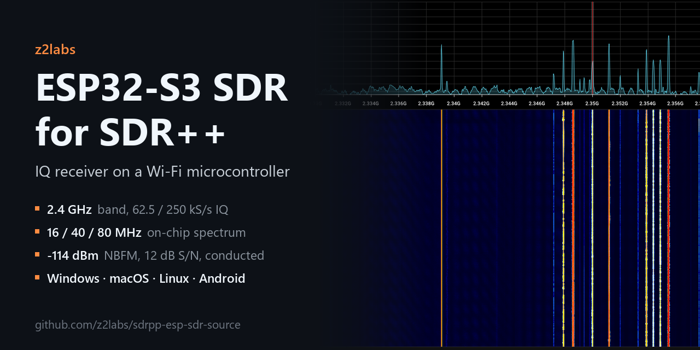
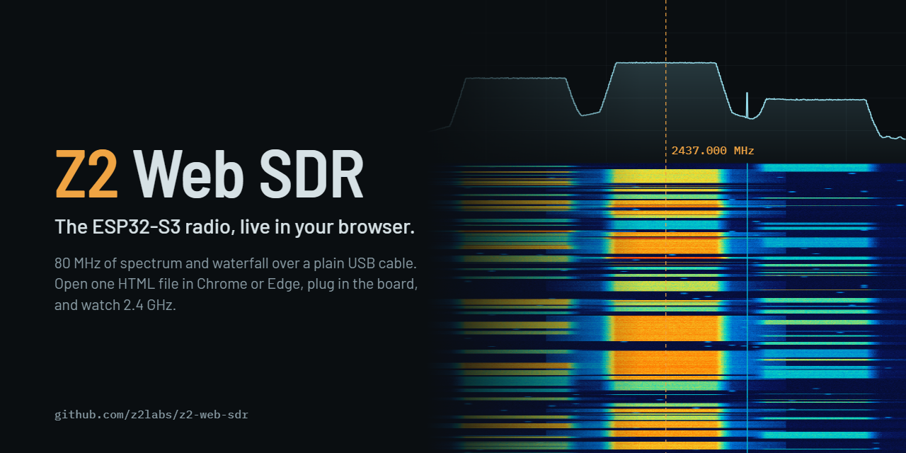
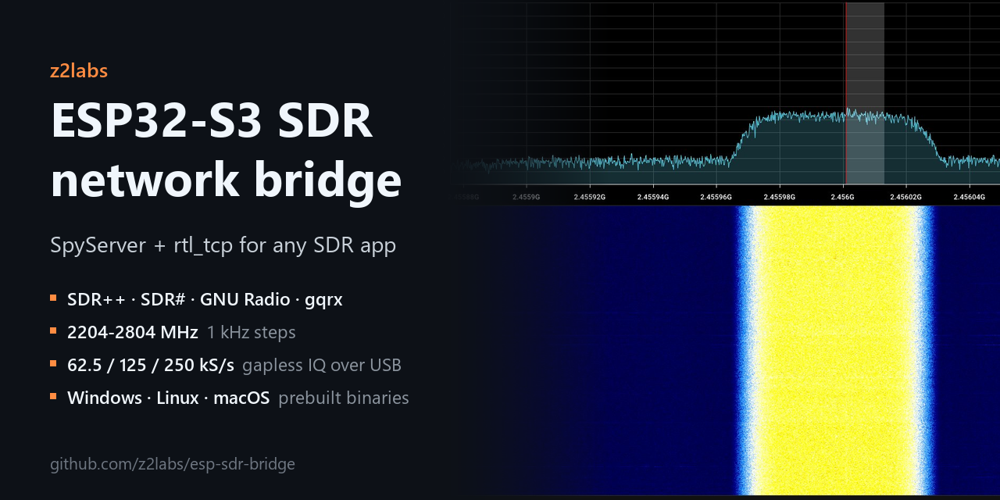

## Fast lane RF troubleshooting

We identify issues, improve functionality and enhance performance at RF, so that you can fully focus on perfecting application-level features. **[z2labs.io](https://www.z2labs.io)**

**Z2Labs** is [Zoltan Papp](https://www.linkedin.com/in/zoltpapp/) and [Zoltan Doczi](https://www.linkedin.com/in/rfsupport/), two electronics engineers with over 20 years of experience in RF hardware. Former coworkers, we have joined forces to offer more comprehensive services.

**How we work.** We do whatever it takes, powered by experience and intuition, to get to the bottom of RF issues as fast as possible. We cut up, patch and firmware-hack PCBs to find the root cause, then suggest production-level fixes on the PCB and in software.

**What we do.** Together with our network of independent hardware and software experts, there is not much around RF hardware and application troubleshooting we cannot cover. We tackle issues head-on, decide fast and communicate clearly.

### Open source

**[sdrpp-esp-sdr-source](https://github.com/z2labs/sdrpp-esp-sdr-source)**: native SDR++ source for an ESP32-S3 running ESP-SDR, with gapless IQ over USB and a 16 / 40 / 80 MHz on-chip spectrum mode. Ready-to-run packages for Windows, macOS, Linux and Android, plus a conducted measurement report (sensitivity, phase noise, noise figure, IMD, blocking) against a HackRF One and a BB60C.

**[Z2 Web SDR](https://github.com/z2labs/z2-web-sdr)**: the ESP32-S3 receiver in a plain browser, no install. One HTML file over Web Serial in Chrome or Edge: 16 / 40 / 80 MHz spectrum and a GPU waterfall at about 270 spectra per second, touch-first on phones and desktops, with the firmware installer built in. **[Open it live](https://z2labs.github.io/z2-web-sdr/)**.

**[esp-sdr-bridge](https://github.com/z2labs/esp-sdr-bridge)**: the same ESP32-S3 receiver as a SpyServer and rtl_tcp server, for SDR#, GNU Radio, gqrx and remote use.

**[SDRPlusPlus](https://github.com/z2labs/SDRPlusPlus)**: SDR++ ESP, the SDR++ fork the packages are built from (branch `esp-sdr`), including the spectrum-streaming work for SDR++ Server.

### Demo videos

*The 80 MHz spectrum in SDR++, SDR++ ESP on Android over USB OTG, and the FM broadcast band through a moRFeus upconverter.*

Need help with an RF problem? **[Get in touch](https://www.z2labs.io)**
